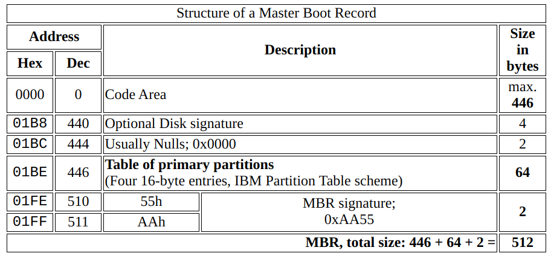
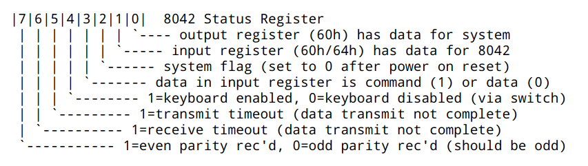

# Lab1 erport

## [练习 1]

[练习 1.1] 操作系统镜像文件 ucore.img 是如何一步一步生成的?(需要比较详细地解释 Makefile 中每一条相关命令和命令参数的含义,以及说明命令导致的结果)

### makefile

- makefile rules

  ```makefile
  <target> : <prerequisites>
  [tab] <command>
  ```

  - target:obj/exe/label
  - prerequisites: request files and/or target?
  - command: any shell command

```makefile
main.o : main.c defs.h
	cc -c main.c
```

- core rule : `if` any prerequisites file `newer` than target,`then` command executed.

- how does makefile works?
  - find `makefile`
  - find the `first` `target`
  - if not `first tar` or `prerequisites newer than tar`:execute;
    - if not `.o`(the prerequisites):find the prerequisites of `.o`:execute
    - `.c` and `.h` must exist
  - command not in the same line has no relation,so add '\' in the tail
- makefile variable
  - for easy and secure
  - just like `#define` in C
  - Eg. `objects = main.o command.o display.o balabala`
    - use `$(objects)` to express
  - remember that make will escape `$`,so
  ```makefile
   test:
   @echo $$HOME
  ```
- make auto derivation
  - if make find `xxx.o`,then it adds `xxx.c` to its prerequis,adds `cc -c xxx.c` to command.
- makefile grammar

  - echo
    - make will print every command then exe it.
    - add `@` to close it. usuallly used in pure echo or #comment
  - wildcard
    - `～`
      - ~/study or ~anig/study
      - in windows,not /home -> find variable `$home`
    - `*`
      - match all chars
      - `\*` match real `*`
  - pattern match `%.o :%.c`
    ```makefile
    f1.o : f1.c
    f2.o : f2.c
    ```
  - variable assignment
  - ont var points to another `v1 = $(v2)`
  - VARIBLE = value #expand while executed,allowed to recurse
  - VARIBLE := value #expand while defined
  - VARIBLE ?= value #only while VAR is empty
  - VARIBLE += value #add to the tail
  - Automatic Variables

    1.  `$@` refers target now
    2.  `$<` refers the first prerequisites
    3.  `$?` refers to all prerequisites newer than target
    4.  `$^` refers to all prerequisites
    5.  `$*` refers to the part of % match
    6.  `$(@D)` , `$(@F)` refers to \$@'s dirname , filename
    7.  `$(<D)` and `$(<F)` refers to \$<'s dirname and filename

            reference :[Automatic Vars](https://www.gnu.org/software/make/manual/html_node/Automatic-Variables.html)

  - judge and loop
    - bash grammar
  - function
    1. shell `src := $(shell echo src/{00..99}.txt )` to exec shell command
    2. wildcard `src := $(wildcard src/*.txt)` to replace the wildcard in bash
    3. subst `$(subst from,to,text)` to replace txt
    4. patsubst `$(patsubst %.c,%.o,x.c.c bar.c)` replace from `x.c.c bar.c` to `x.c.o bar.o`
    5. replace suffix name`min : $(output:.js=.min.js)`
    6. To understand `eval()` in [new.mk]
       - recursion
       - reference : [eval()](http://bbs.chinaunix.net/thread-2321462-3-1.html)
  - add `-` at the start to omit

```makefile
bin/ucore.img
| 生成ucore.img的相关代码为
| $(UCOREIMG): $(kernel) $(bootblock)
|	$(V)dd if=/dev/zero of=$@ count=10000
|	$(V)dd if=$(bootblock) of=$@ conv=notrunc
|	$(V)dd if=$(kernel) of=$@ seek=1 conv=notrunc
|
| 为了生成ucore.img，首先需要生成bootblock、kernel
|
|>	bin/bootblock
|	| 生成bootblock的相关代码为
|	| $(bootblock): $(call toobj,$(bootfiles)) | $(call totarget,sign)
|	|	@echo + ld $@
|	|	$(V)$(LD) $(LDFLAGS) -N -e start -Ttext 0x7C00 $^ \
|	|		-o $(call toobj,bootblock)
|	|	@$(OBJDUMP) -S $(call objfile,bootblock) > \
|	|		$(call asmfile,bootblock)
|	|	@$(OBJCOPY) -S -O binary $(call objfile,bootblock) \
|	|		$(call outfile,bootblock)
|	|	@$(call totarget,sign) $(call outfile,bootblock) $(bootblock)
|	|
|	| 为了生成bootblock，首先需要生成bootasm.o、bootmain.o、sign
|	|
|	|>	obj/boot/bootasm.o, obj/boot/bootmain.o
|	|	| 生成bootasm.o,bootmain.o的相关makefile代码为
|	|	| bootfiles = $(call listf_cc,boot)
|	|	| $(foreach f,$(bootfiles),$(call cc_compile,$(f),$(CC),\
|	|	|	$(CFLAGS) -Os -nostdinc))
|	|	| 实际代码由宏批量生成
|	|	|
|	|	| 生成bootasm.o需要bootasm.S
|	|	| 实际命令为
|	|	| gcc -Iboot/ -fno-builtin -Wall -ggdb -m32 -gstabs \
|	|	| 	-nostdinc  -fno-stack-protector -Ilibs/ -Os -nostdinc \
|	|	| 	-c boot/bootasm.S -o obj/boot/bootasm.o
|	|	| 其中关键的参数为
|	|	| 	-ggdb  生成可供gdb使用的调试信息。这样才能用qemu+gdb来调试bootloader or ucore。
|	|	|	-m32  生成适用于32位环境的代码。我们用的模拟硬件是32bit的80386，所以ucore也要是32位的软件。
|	|	| 	-gstabs  生成stabs格式的调试信息。这样要ucore的monitor可以显示出便于开发者阅读的函数调用栈信息
|	|	| 	-nostdinc  不使用标准库。标准库是给应用程序用的，我们是编译ucore内核，OS内核是提供服务的，所以所有的服务要自给自足。
|	|	|	-fno-stack-protector  不生成用于检测缓冲区溢出的代码。这是for 应用程序的，我们是编译内核，ucore内核好像还用不到此功能。
|	|	| 	-Os  为减小代码大小而进行优化。根据硬件spec，主引导扇区只有512字节，我们写的简单bootloader的最终大小不能大于510字节。
|	|	| 	-I<dir>  添加搜索头文件的路径
|	|	|
|	|	| 生成bootmain.o需要bootmain.c
|	|	| 实际命令为
|	|	| gcc -Iboot/ -fno-builtin -Wall -ggdb -m32 -gstabs -nostdinc \
|	|	| 	-fno-stack-protector -Ilibs/ -Os -nostdinc \
|	|	| 	-c boot/bootmain.c -o obj/boot/bootmain.o
|	|	| 新出现的关键参数有
|	|	| 	-fno-builtin  除非用__builtin_前缀，
|	|	|	              否则不进行builtin函数的优化
|	|
|	|>	bin/sign
|	|	| 生成sign工具的makefile代码为
|	|	| $(call add_files_host,tools/sign.c,sign,sign)
|	|	| $(call create_target_host,sign,sign)
|	|	|
|	|	| 实际命令为
|	|	| gcc -Itools/ -g -Wall -O2 -c tools/sign.c \
|	|	| 	-o obj/sign/tools/sign.o
|	|	| gcc -g -Wall -O2 obj/sign/tools/sign.o -o bin/sign
|	|
|	| 首先生成bootblock.o
|	| ld -m    elf_i386 -nostdlib -N -e start -Ttext 0x7C00 \
|	|	obj/boot/bootasm.o obj/boot/bootmain.o -o obj/bootblock.o
|	| 其中关键的参数为
|	|	-m <emulation>  模拟为i386上的连接器
|	|	-nostdlib  不使用标准库
|	|	-N  设置代码段和数据段均可读写
|	|	-e <entry>  指定入口
|	|	-Ttext  制定代码段开始位置
|	|
|	| 拷贝二进制代码bootblock.o到bootblock.out
|	| objcopy -S -O binary obj/bootblock.o obj/bootblock.out
|	| 其中关键的参数为
|	|	-S  移除所有符号和重定位信息
|	|	-O <bfdname>  指定输出格式
|	|
|	| 使用sign工具处理bootblock.out，生成bootblock
|	| bin/sign obj/bootblock.out bin/bootblock
|
|>	bin/kernel
|	| 生成kernel的相关代码为
|	| $(kernel): tools/kernel.ld
|	| $(kernel): $(KOBJS)
|	| 	@echo + ld $@
|	| 	$(V)$(LD) $(LDFLAGS) -T tools/kernel.ld -o $@ $(KOBJS)
|	| 	@$(OBJDUMP) -S $@ > $(call asmfile,kernel)
|	| 	@$(OBJDUMP) -t $@ | $(SED) '1,/SYMBOL TABLE/d; s/ .* / /; \
|	| 		/^$$/d' > $(call symfile,kernel)
|	|
|	| 为了生成kernel，首先需要 kernel.ld init.o readline.o stdio.o kdebug.o
|	|	kmonitor.o panic.o clock.o console.o intr.o picirq.o trap.o
|	|	trapentry.o vectors.o pmm.o  printfmt.o string.o
|	| kernel.ld已存在
|	|
|	|>	obj/kern/*/*.o
|	|	| 生成这些.o文件的相关makefile代码为
|	|	| $(call add_files_cc,$(call listf_cc,$(KSRCDIR)),kernel,\
|	|	|	$(KCFLAGS))
|	|	| 这些.o生成方式和参数均类似，仅举init.o为例，其余不赘述
|	|>	obj/kern/init/init.o
|	|	| 编译需要init.c
|	|	| 实际命令为
|	|	|	gcc -Ikern/init/ -fno-builtin -Wall -ggdb -m32 \
|	|	|		-gstabs -nostdinc  -fno-stack-protector \
|	|	|		-Ilibs/ -Ikern/debug/ -Ikern/driver/ \
|	|	|		-Ikern/trap/ -Ikern/mm/ -c kern/init/init.c \
|	|	|		-o obj/kern/init/init.o
|	|
|	| 生成kernel时，makefile的几条指令中有@前缀的都不必需
|	| 必需的命令只有
|	| ld -m    elf_i386 -nostdlib -T tools/kernel.ld -o bin/kernel \
|	| 	obj/kern/init/init.o obj/kern/libs/readline.o \
|	| 	obj/kern/libs/stdio.o obj/kern/debug/kdebug.o \
|	| 	obj/kern/debug/kmonitor.o obj/kern/debug/panic.o \
|	| 	obj/kern/driver/clock.o obj/kern/driver/console.o \
|	| 	obj/kern/driver/intr.o obj/kern/driver/picirq.o \
|	| 	obj/kern/trap/trap.o obj/kern/trap/trapentry.o \
|	| 	obj/kern/trap/vectors.o obj/kern/mm/pmm.o \
|	| 	obj/libs/printfmt.o obj/libs/string.o
|	| 其中新出现的关键参数为
|	|	-T <scriptfile>  让连接器使用指定的脚本
|
| 生成一个有10000个块的文件，每个块默认512字节，用0填充
| dd if=/dev/zero of=bin/ucore.img count=10000
|
| 把bootblock中的内容写到第一个块
| dd if=bin/bootblock of=bin/ucore.img conv=notrunc
|
| 从第二个块开始写kernel中的内容
| dd if=bin/kernel of=bin/ucore.img seek=1 conv=notrunc
```

[练习 1.2] 一个被系统认为是符合规范的硬盘主引导扇区的特征是什么?

从 sign.c 的代码来看，一个磁盘主引导扇区只有 512 字节。且
第 510 个（倒数第二个）字节是 0x55，
第 511 个（倒数第一个）字节是 0xAA。



## [练习 2]

[练习 2.1] 从 CPU 加电后执行的第一条指令开始,单步跟踪 BIOS 的执行。

练习 2 可以单步跟踪，方法如下：

1 修改 lab1/tools/gdbinit,内容为:

```sh
set architecture i8086
target remote :1234
```

2 在 lab1 目录下，执行

```sh
make debug
```

3 在看到 gdb 的调试界面(gdb)后，在 gdb 调试界面下执行如下命令

```makefile
si
```

即可单步跟踪 BIOS 了。

4 在 gdb 界面下，可通过如下命令来看 BIOS 的代码

```nasm
 x /2i $pc  //显示当前eip处的汇编指令
```

[进一步的补充]

```makefile
改写Makefile文件
	debug: $(UCOREIMG)
		$(V)$(TERMINAL) -e "$(QEMU) -S -s -d in_asm -D $(BINDIR)/q.log -parallel stdio -hda $< -serial null"
		$(V)sleep 2
		$(V)$(TERMINAL) -e "gdb -q -tui -x tools/gdbinit"
```

在调用 qemu 时增加`-d in_asm -D q.log`参数，便可以将运行的汇编指令保存在 q.log 中。
为防止 qemu 在 gdb 连接后立即开始执行，删除了`tools/gdbinit`中的`continue`行。

[练习 2.2] 在初始化位置 0x7c00 设置实地址断点,测试断点正常。

在 tools/gdbinit 结尾加上

```nasm
    set architecture i8086  //设置当前调试的CPU是8086
	b *0x7c00  //在0x7c00处设置断点。此地址是bootloader入口点地址，可看boot/bootasm.S的start地址处
	c          //continue简称，表示继续执行
	x /2i $pc  //显示当前eip处的汇编指令
	set architecture i386  //设置当前调试的CPU是80386
```

运行"make debug"便可得到

```nasm
	Breakpoint 2, 0x00007c00 in ?? ()
	=> 0x7c00:      cli
	   0x7c01:      cld
	   0x7c02:      xor    %eax,%eax
	   0x7c04:      mov    %eax,%ds
	   0x7c06:      mov    %eax,%es
	   0x7c08:      mov    %eax,%ss
	   0x7c0a:      in     $0x64,%al
	   0x7c0c:      test   $0x2,%al
	   0x7c0e:      jne    0x7c0a
	   0x7c10:      mov    $0xd1,%al
```

[练习 2.3] 在调用 qemu 时增加-d in_asm -D q.log 参数，便可以将运行的汇编指令保存在 q.log 中。
将执行的汇编代码与 bootasm.S 和 bootblock.asm 进行比较，看看二者是否一致。

在 tools/gdbinit 结尾加上

```nasm
	b *0x7c00
	c
	x /10i $pc
```

便可以在 q.log 中读到"call bootmain"前执行的命令

```nasm
	----------------
	IN:
	0x00007c00:  cli

	----------------
	IN:
	0x00007c01:  cld
	0x00007c02:  xor    %ax,%ax
	0x00007c04:  mov    %ax,%ds
	0x00007c06:  mov    %ax,%es
	0x00007c08:  mov    %ax,%ss

	----------------
	IN:
	0x00007c0a:  in     $0x64,%al

	----------------
	IN:
	0x00007c0c:  test   $0x2,%al
	0x00007c0e:  jne    0x7c0a

	----------------
	IN:
	0x00007c10:  mov    $0xd1,%al
	0x00007c12:  out    %al,$0x64
	0x00007c14:  in     $0x64,%al
	0x00007c16:  test   $0x2,%al
	0x00007c18:  jne    0x7c14

	----------------
	IN:
	0x00007c1a:  mov    $0xdf,%al
	0x00007c1c:  out    %al,$0x60
	0x00007c1e:  lgdtw  0x7c6c
	0x00007c23:  mov    %cr0,%eax
	0x00007c26:  or     $0x1,%eax
	0x00007c2a:  mov    %eax,%cr0

	----------------
	IN:
	0x00007c2d:  ljmp   $0x8,$0x7c32

	----------------
	IN:
	0x00007c32:  mov    $0x10,%ax
	0x00007c36:  mov    %eax,%ds

	----------------
	IN:
	0x00007c38:  mov    %eax,%es

	----------------
	IN:
	0x00007c3a:  mov    %eax,%fs
	0x00007c3c:  mov    %eax,%gs
	0x00007c3e:  mov    %eax,%ss

	----------------
	IN:
	0x00007c40:  mov    $0x0,%ebp

	----------------
	IN:
	0x00007c45:  mov    $0x7c00,%esp
	0x00007c4a:  call   0x7d0d

	----------------
	IN:
	0x00007d0d:  push   %ebp
```

其与 bootasm.S 和 bootblock.asm 中的代码相同。

## [练习 3]

分析 bootloader 进入保护模式的过程。

### 分段存储机制

- From Locgical Adds to Physical Adds

#### logical address

#### descriptor

#### descriptor table

#### seg selector

从`%cs=0 $pc=0x7c00`，进入后

首先清理环境：包括将 flag 置 0 和将段寄存器置 0

```nasm
	.code16
	    cli
	    cld
	    xorw %ax, %ax
	    movw %ax, %ds
	    movw %ax, %es
	    movw %ax, %ss
```

#### Flag Instruction

- cli (Clear Interrupt Flag)
  - operation : 0->IF
  - clear the if if the cur privilege level is at least as privileged as **IOPL**
    - IOPL? change I/O privilege level
- cld (Clear Direction Flag)
  - 0->DF
  - it means that string is processed beginning from lowest to highest address
  - auto-incrementing

开启 A20：通过将键盘控制器上的 A20 线置于高电位，全部 32 条地址线可用，
可以访问 4G 的内存空间。

```nasm
	seta20.1:               # 等待8042键盘控制器不忙
	    inb $0x64, %al      #
	    testb $0x2, %al     # if
	    jnz seta20.1        #

	    movb $0xd1, %al     # 发送写8042输出端口的指令
	    outb %al, $0x64     #

	seta20.2:               # 等待8042键盘控制器不忙
	    inb $0x64, %al      #
	    testb $0x2, %al     #
	    jnz seta20.2        #

	    movb $0xdf, %al     # 打开A20
	    outb %al, $0x60     #
```

- in(b)
  - input (byte)/word/dword from port al into 0x64
- 8042 Status Register (port 64h read)
  > Port 0x64 (Command Port) is used for sending commands to keyboard controller (PS/2).
  > Port 0x60 (Data Port) is used for sending data to/from PS/2(Keyboard) controller or the PS/2 device itself.



```nasm
testb $0x2, %al   if the low 2th bit is 1;
jnz seta20.1      jump
```

- eax ax al ah
  - EAX is the full 32-bit value
  - AX is the lower 16-bits
  - AL is the lower 8 bits
  - AH is the bits 8 through 15 (zero-based)

初始化 GDT 表：一个简单的 GDT 表和其描述符已经静态储存在引导区中，载入即可

```nasm
 lgdt gdtdesc
```

进入保护模式：通过将 cr0 寄存器 PE 位置 1 便开启了保护模式

```nasm
movl %cr0, %eax
orl $CR0_PE_ON, %eax
movl %eax, %cr0
```

- cr0 ( control register )
  

通过长跳转更新 cs 的基地址

```nasm
	 ljmp $PROT_MODE_CSEG, $protcseg
	.code32
	protcseg:
```

设置段寄存器，并建立堆栈

```nasm
	    movw $PROT_MODE_DSEG, %ax   accumulator
	    movw %ax, %ds  data
	    movw %ax, %es   extra
	    movw %ax, %fs	flag
	    movw %ax, %gs	global
	    movw %ax, %ss	stack
	    movl $0x0, %ebp  0x7c00  base
	    movl $start, %esp   stack
```

转到保护模式完成，进入 boot 主方法

```nasm
	    call bootmain
```

## [练习 4]

分析 bootloader 加载 ELF 格式的 OS 的过程。

- BIOS reads the first sector of the disk and writes it to asdds 0x7C00.But how it accesses the disk?

  - To solve this problem, the ISA uses a
    specified block of memory, addresses 0x1F0-0x1F7,

    ```nasm
    Control Register:
    Address 0x3F6 = 0x80 (0000 1RE0): R=reset, E=0 means "enable interrupt"
    Command Block Registers:
    Address 0x1F0 = Data Port
    Address 0x1F1 = Error
    Address 0x1F2 = Sector Count
    Address 0x1F3 = LBA low byte
    Address 0x1F4 = LBA mid byte
    Address 0x1F5 = LBA high byte
    Address 0x1F6 = 1B1D TOP4LBA: B=LBA, D=drive
    Address 0x1F7 = Command/status

        Status Register (Address 0x1F7):
        7     6 	 5 	  4    3 	2 	 1 	   0
        BUSY READY FAULT SEEK DRQ CORR IDDEX ERROR

        Error Register (Address 0x1F1): (check when Status ERROR==1)
        7	6	5	4	 3	  2	  1	   0
        BBK UNC MC IDNF MCR ABRT T0NF AMNF

        BBK = Bad Block
        UNC = Uncorrectable data error
        MC = Media Changed
        IDNF = ID mark Not Found
        MCRMedia = Change Requested
        ABRT = Command aborted
        T0NF = Track 0 Not Found
        AMNF = Address Mark Not Found

        • Wait for drive to be ready. Read Status Register (0x1F7) until drive is not busy and READY.
        • Write parameters to command registers. Write the sector count,logical block address (LBA) of the sectors to be accessed, and drive number (master=0x00 or slave=0x10, as IDE permits just two drives)to command registers (0x1F2-0x1F6).
        • Start the I/O. by issuing read/write to command register. Write READ—WRITE command to command register (0x1F7).
        • Data transfer (for writes): Wait until drive status is READY and DRQ (drive request for data); write data to data port.
        • Handle interrupts. In the simplest case, handle an interrupt for each sector transferred; more complex approaches allow batching and thus one final interrupt when the entire transfer is complete.
        • Error handling. After each operation, read the status register. If the ERROR bit is on, read the error register for details.
    ```

- waitdisk();

  ```c
  do
  {
    	while ((inb(0x1F7) & 0xC0) != 0x40)
        /* do nothing */;
  }

      inb(0x1F7)&0=0
  ```

- `readsect()`从设备的第 secno 扇区读取数据到 dst 位置

```c
	static void
	readsect(void *dst, uint32_t secno) {
	    waitdisk();

	    outb(0x1F2, 1);           // 设置读取扇区的数目为1
	    outb(0x1F3, secno & 0xFF);
	    outb(0x1F4, (secno >> 8) & 0xFF);
	    outb(0x1F5, (secno >> 16) & 0xFF);
	    outb(0x1F6, ((secno >> 24) & 0xF) | 0xE0);
		                            & 0000 1111 | 1110 0000
									// 0xE0 = 1110 0000代表LBA寻址, 并且使用master
	        // 上面四条指令联合制定了扇区号
	        // 在这4个字节线联合构成的32位参数中
	        //   29-31位强制设为1
	        //   28位(=0)表示访问"Disk 0"
	        //   0-27位是28位的偏移量
	    outb(0x1F7, 0x20);   // sata 0x20命令，读取扇区
	    waitdisk();
	    insl(0x1F0, dst, SECTSIZE / 4); // 读取到dst位置，
	                    // 幻数4因为这里以DW为单位
					// get results as 128 "long words"
					// 1 long word == 4 bytes;
	}
```

- readseg（）简单包装了 readsect，可以从设备读取任意长度的内容。

```c
	static void
	readseg(uintptr_t va, uint32_t count, uint32_t offset) {
	    uintptr_t end_va = va + count;

	    va -= offset % SECTSIZE;

	    uint32_t secno = (offset / SECTSIZE) + 1;
	    // 加1因为0扇区被引导占用
	    // ELF文件从1扇区开始

	    for (; va < end_va; va += SECTSIZE, secno ++) {
	        readsect((void *)va, secno);
	    }
	}
```

- bootmain()函数

```c
	void
	bootmain(void) {
	    // 首先读取ELF的头部
	    readseg((uintptr_t)ELFHDR, SECTSIZE * 8, 0);

	    // 通过储存在头部的幻数判断是否是合法的ELF文件
	    if (ELFHDR->e_magic != ELF_MAGIC) {
	        goto bad;
	    }

	    struct proghdr *ph, *eph;

	    // ELF头部有描述ELF文件应加载到内存什么位置的描述表，
	    // 先将描述表的头地址存在ph
	    ph = (struct proghdr *)((uintptr_t)ELFHDR + ELFHDR->e_phoff);
	    eph = ph + ELFHDR->e_phnum;

	    // 按照描述表将ELF文件中数据载入内存
	    for (; ph < eph; ph ++) {
	        readseg(ph->p_va & 0xFFFFFF, ph->p_memsz, ph->p_offset);
	    }
	    // ELF文件0x1000位置后面的0xd1ec比特被载入内存0x00100000
	    // ELF文件0xf000位置后面的0x1d20比特被载入内存0x0010e000

	    // 根据ELF头部储存的入口信息，找到内核的入口
	    ((void (*)(void))(ELFHDR->e_entry & 0xFFFFFF))();

	bad:
	    outw(0x8A00, 0x8A00);
	    outw(0x8A00, 0x8E00);
	    while (1);
	}
```

## [练习 5]

实现函数调用堆栈跟踪函数

ss:ebp 指向的堆栈位置储存着 caller 的 ebp，以此为线索可以得到所有使用堆栈的函数 ebp。
ss:ebp+4 指向 caller 调用时的 eip，ss:ebp+8 等是（可能的）参数。

输出中，堆栈最深一层为

```nasm
	ebp:0x00007bf8 eip:0x00007d68 \
		args:0x00000000 0x00000000 0x00000000 0x00007c4f
	    <unknow>: -- 0x00007d67 --
```

其对应的是第一个使用堆栈的函数，bootmain.c 中的 bootmain。
bootloader 设置的堆栈从 0x7c00 开始，使用"call bootmain"转入 bootmain 函数。
call 指令压栈，所以 bootmain 中 ebp 为 0x7bf8。

## [练习 6]

完善中断初始化和处理

[练习 6.1] 中断向量表中一个表项占多少字节？其中哪几位代表中断处理代码的入口？

中断向量表一个表项占用 8 字节，其中 2-3 字节是段选择子，0-1 字节和 6-7 字节拼成位移，
两者联合便是中断处理程序的入口地址。

[练习 6.2] 请编程完善 kern/trap/trap.c 中对中断向量表进行初始化的函数 idt_init。

见代码

[练习 6.3] 请编程完善 trap.c 中的中断处理函数 trap，在对时钟中断进行处理的部分填写 trap 函数

见代码

## [练习 7]

增加 syscall 功能，即增加一用户态函数（可执行一特定系统调用：获得时钟计数值），
当内核初始完毕后，可从内核态返回到用户态的函数，而用户态的函数又通过系统调用得到内核态的服务

在 idt_init 中，将用户态调用 SWITCH_TOK 中断的权限打开。
SETGATE(idt[T_SWITCH_TOK], 1, KERNEL_CS, \_\_vectors[T_SWITCH_TOK], 3);

在 trap_dispatch 中，将 iret 时会从堆栈弹出的段寄存器进行修改
对 TO User

```c
	    tf->tf_cs = USER_CS;
	    tf->tf_ds = USER_DS;
	    tf->tf_es = USER_DS;
	    tf->tf_ss = USER_DS;
```

对 TO Kernel

```c
	    tf->tf_cs = KERNEL_CS;
	    tf->tf_ds = KERNEL_DS;
	    tf->tf_es = KERNEL_DS;
```

在 lab1_switch_to_user 中，调用 T_SWITCH_TOU 中断。
注意从中断返回时，会多 pop 两位，并用这两位的值更新 ss,sp，损坏堆栈。
所以要先把栈压两位，并在从中断返回后修复 esp。

```nasm
	asm volatile (
	    "sub $0x8, %%esp \n"
	    "int %0 \n"
	    "movl %%ebp, %%esp"
	    :
	    : "i"(T_SWITCH_TOU)
	);
```

在 lab1_switch_to_kernel 中，调用 T_SWITCH_TOK 中断。
注意从中断返回时，esp 仍在 TSS 指示的堆栈中。所以要在从中断返回后修复 esp。

```nasm
	asm volatile (
	    "int %0 \n"
	    "movl %%ebp, %%esp \n"
	    :
	    : "i"(T_SWITCH_TOK)
	);
```

但这样不能正常输出文本。根据提示，在 trap_dispatch 中转 User 态时，将调用 io 所需权限降低。

```nasm
	tf->tf_eflags |= 0x3000;
```
